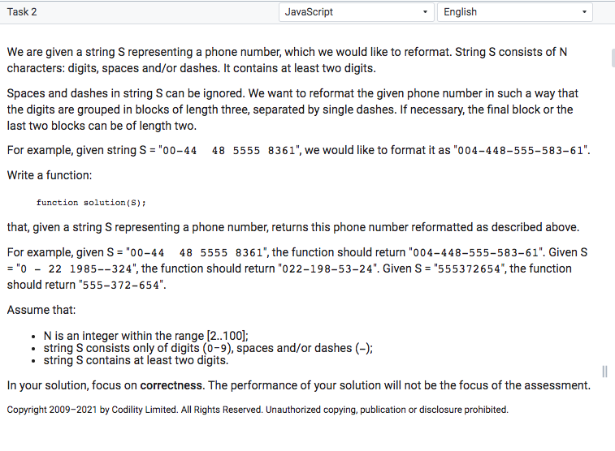

We are given a string S representing a phone number, which we would like to reformat. String S consists of N characters: digits, spaces and/or dashes.

It contains at least two digits.
Spaces and dashes in string S can be ignored. We want to reformat the given phone number in such a way that the digits are grouped in blocks of length three, separated by single dashes. If necessary, the final block or the last two blocks can be of length two.

For example, given string `S = "00-44 4B 5555 8361"`, we would like to format it as `"004-448-555—583-61"`.

Write a function:
```
function solution(S);
```
that, given a string S representing a phone number, returns this phone number reformatted as described above.
For example, given `"00-44 4B 5555 8361"`, the function should return `"004-448-555-583-61"`. Given S
"0 - 22 1985--324", the function should return `"022-198-53-24"`. Given `S = "555372654"`, the function should return `"555-3 72-654"`.

Assume that:
• N is an integer within the range `[2..100]`;
• string S consists only of digits (0-9), spaces and/or dashes (-);
• string S contains at least two digits.

In your solution, focus on correctness. The performance of your solution will not be the focus of the assessment.

Copyright 2009—2021 by Codility Limited. All Rights Reserved. Unauthorized copying, publication or disclosure prohibited.

## Original Exercice
